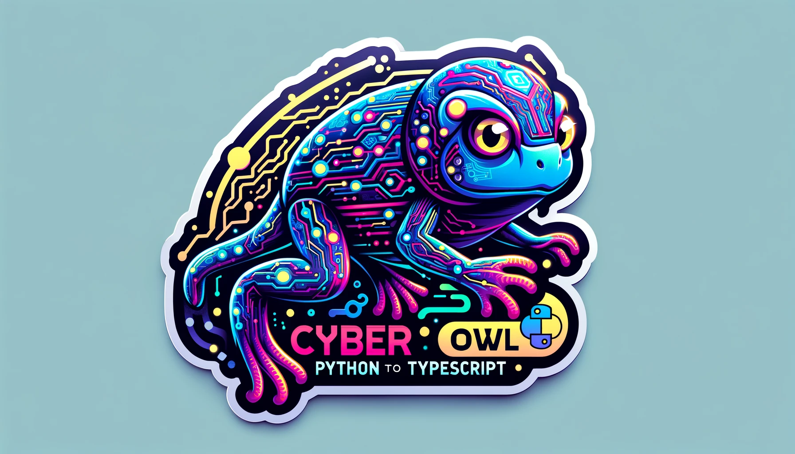

# Python to TypeScript Cyber Owl Tadpole



## Overview

This project is a simple example of setting up a TypeScript project with an Express server that serves a 3D graph using Three.js. The server fetches global air quality data from an open API and displays it on a rotating 3D graph.

## Features

- **Express Server**: Serves static files and handles API requests.
- **Three.js Integration**: Displays a rotating 3D cube in the browser.
- **Air Quality Data**: Fetches and displays global air quality data from the OpenAQ API.
- **Docker Support**: Containerizes the application using Podman.

## Prerequisites

- **Node.js 16**: Ensure you have Node.js version 16 installed.
- **Podman**: Used for containerizing and running the application.

## Setup

### 1. Clone the Repository

```bash
git clone https://github.com/essingen123/python-to-ts-cyber-owl-tadpoles.git
cd python-to-ts-cyber-owl-tadpoles
```

### 2. Run the Python Script

This script sets up the project, installs dependencies, and runs the server.

```bash
python python_to_typescript_cyber_owl_tadpole.py
```

### 3. Access the Application

Open your browser and navigate to `http://localhost:3000` to see the 3D graph and air quality data.

## Repository Structure

- **server.ts**: The main TypeScript file for the Express server.
- **public/**: Contains static files served by the server, including the HTML file for the 3D graph.
- **Dockerfile**: Defines the Docker image for the application.
- **run.sh**: Shell script to build and run the Docker container.
- **python_to_typescript_cyber_owl_tadpole.py**: Python script to set up the project.

## Work in Progress

This is a work-in-progress demo of converting Python orchestration to produce TypeScript into JavaScript.

## License

This project is licensed under the MIT License. See the [LICENSE](LICENSE) file for details.

## Contact

For any questions or suggestions, please open an issue or contact the repository owner.
